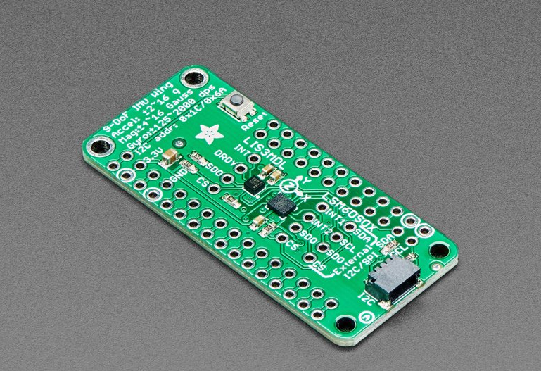
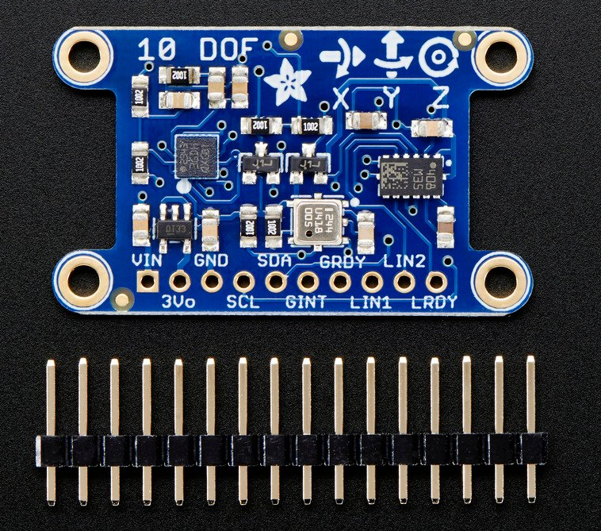

# Milestone-Meeting 01.07.2021

## Software

### Struggle

We have been and we are still strugglung with the evaluation of our measured data which include acceleration and gyroscope data.

### What we accomplished so far

so far we've written two python programms, which help us attain our goal.

The first one analyzes every line in the csv to find duplicates and writes a new csv file without those duplicates.

The Second is a prototype that guides us into going into the right direction when trying to plot.

This is not the final program.

### Goal

Our goal is to write a python script that enables us to see the desired measurements, plotted in a specific way that helps us to easily analyze and detect turbulences.

## Hardware

We are aiming to find a good price to performance ratio and easy implementable sensor for the next experemential weather baloon flight.

We have found two sensors that best suit our needs:

https://www.adafruit.com/product/4565

*3 axes of accelerometer data
*3 axes gyroscopic
*3 axes magnetic (compass)

https://www.adafruit.com/product/1604

*3 axes of accelerometer data
*3 axes gyroscopic
*3 axes magnetic (compass)
*barometric pressure/altitude
*temperature.

Both sensors are easy to implement because they use the same libraries as the sensor of the first experiment.

The greatest challenge will be to solder and connect all the necessary parts.
